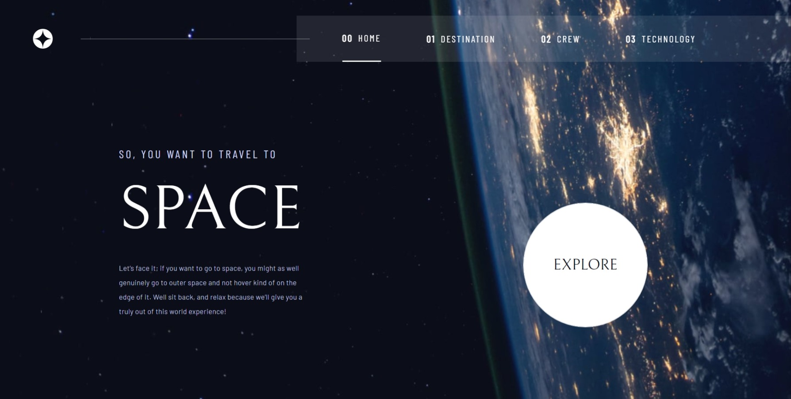

# Frontend Mentor - Space tourism website solution

This is a solution to the [Space tourism website challenge on Frontend Mentor](https://www.frontendmentor.io/challenges/space-tourism-multipage-website-gRWj1URZ3). Frontend Mentor challenges help you improve your coding skills by building realistic projects. 

## Table of contents

- [Frontend Mentor - Space tourism website solution](#frontend-mentor---space-tourism-website-solution)
  - [Table of contents](#table-of-contents)
  - [Overview](#overview)
    - [The challenge](#the-challenge)
    - [Screenshot](#screenshot)
    - [Links](#links)
  - [My process](#my-process)
    - [Built with](#built-with)
    - [Continued development](#continued-development)
    - [Useful resources](#useful-resources)
  - [Author](#author)
  - [Acknowledgments](#acknowledgments)

**Note: Delete this note and update the table of contents based on what sections you keep.**

## Overview

### The challenge

Users should be able to:

- View the optimal layout for each of the website's pages depending on their device's screen size
- See hover states for all interactive elements on the page
- View each page and be able to toggle between the tabs to see new information

### Screenshot

### Links

Tbc
<!-- - Solution URL: [Add solution URL here](https://your-solution-url.com)
- Live Site URL: [Add live site URL here](https://your-live-site-url.com) -->

## My process

### Built with

- Semantic HTML5 markup
- CSS custom properties
- Flexbox
- [Sass](https://sass-lang.com/) - CSS3 Preprocessor
- [React](https://reactjs.org/) - JS library
- [Create React App](https://create-react-app.dev/) - React Toolkit
- [Slugify](https://www.npmjs.com/package/slugify) - Slugify package
- [react-responsive](https://www.npmjs.com/package/react-responsive) - React-responsive package
- [PropTypes](https://www.npmjs.com/package/prop-types) - PropTypes package for props validation

### Continued development

I would like to learn how to efficiently refactoring my code in my Components. There's a repetition on hooks & some functions and I would like to avoid that from now on.

I know now I need to code my applications with a mobile-first workflow, will be easier and quicker to adapt to desktop & tablets :wink:

### Useful resources

- [Flexbox Cheatsheet](https://css-tricks.com/snippets/css/a-guide-to-flexbox/#flexbox-properties) - Because why shouldn't I use this ? :D
- [Josh Comeau's blog - Embracing modern image formats](https://www.joshwcomeau.com/performance/embracing-modern-image-formats/) - For some knowledge about webp & PNG images

## Author

- Website - [Add your name here](https://www.your-site.com)
- Frontend Mentor - [@CrazyWolv](https://www.frontendmentor.io/profile/CrazyWolv)

## Acknowledgments

Thanks to my friend's [Anthony Simonneau](https://github.com/Anthony-S58) who coded at the same time as me on this very same project (in his own repository), it was great !
